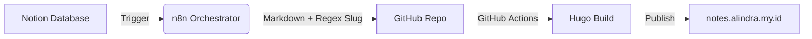

# 📔 Ardnotes - Alindra's Digital Garden

**Ardnotes** adalah ekosistem catatan teknis otomatis yang dirancang untuk mendokumentasikan perjalanan saya sebagai **Solution Architect**. Sistem ini mengintegrasikan fleksibilitas penulisan di Notion dengan performa statis Hugo melalui pipa otomasi n8n.

---

## 🏗️ System Architecture

Website ini beroperasi dengan alur kerja **CI/CD** penuh dari hulu ke hilir:

🛠️ Tech Stack
Sebagai proyek berbasis efisiensi, infrastruktur ini menggunakan:
- CMS: Notion sebagai pusat basis data catatan.
- Engine: Hugo dengan tema PaperMod.
- Automation: n8n untuk transformasi data dan slug generation otomatis.
- CI/CD: GitHub Actions untuk proses deployment otomatis pada setiap push.

⚙️ Automation Logic (n8n)
Workflow n8n saya (Notes Poster) memiliki tiga metode pemicu:
- Scheduled: Sinkronisasi otomatis setiap pukul 22:00 WIB [cite: 12-01-2026].
- Webhook: Tombol "Manual Publish" langsung dari dalam halaman Notion.
- Instant: Eksekusi manual melalui dashboard n8n.
Sistem secara otomatis mengubah judul catatan menjadi slug yang valid dan merakit Frontmatter YAML agar kompatibel dengan tema Hugo.

📂 Project Structure
- .github/workflows/: Skrip GitHub Actions (gh-pages.yml).
- content/posts/: Output artikel .md hasil sinkronisasi n8n.
- themes/PaperMod/: Submodule tema blog.
- hugo.yaml: Konfigurasi utama site (Domain & Menu).
- static/: Aset gambar dan file statis lainnya.

👤 Maintainer
- Alindra Setya Ardana
- Role: Presales Engineer / Solution Architect Enthusiast.
- Interests: IT Networking, Security, and Agentic AI.

Last updated: January 21, 2026
