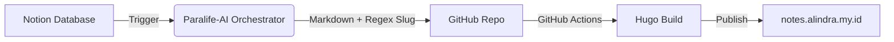

# 📔 Ardnotes - Alindra's Digital Garden

**Ardnotes** adalah ekosistem catatan teknis otomatis yang dirancang untuk mendokumentasikan perjalanan saya sebagai **Presales Engineer dan Tech Enthusiast**. Sistem ini mengintegrasikan fleksibilitas penulisan di Notion dengan performa statis Hugo, diorkestrasi oleh [Paralife-AI](https://github.com/alsetyaardana/paralife-ai.git).

---

## 🏗️ System Architecture

Website ini beroperasi dengan alur kerja **CI/CD** penuh dari hulu ke hilir:

```mermaid
graph LR
    A[Notion Database] -- "Trigger" --> B(Paralife-AI Orchestrator)
    B -- "Markdown + Regex Slug" --> C[GitHub Repo]
    C -- "GitHub Actions" --> D[Hugo Build]
    D -- "Publish" --> E[notes.alindra.my.id]
```
🛠️ Tech Stack
Sebagai proyek berbasis efisiensi, infrastruktur ini menggunakan:
- CMS: Paralife AI sebagai pusat basis data catatan.
- Engine: Hugo dengan tema PaperMod.
- Automation: [Paralife-AI](https://github.com/alsetyaardana/paralife-ai.git) untuk transformasi data, SEO dan slug generation otomatis.
- CI/CD: GitHub Actions untuk proses deployment otomatis pada setiap push.

⚙️ Automation Logic (Paralife-AI)
Manajemen automasi catatan sekarang dipindahkan dari n8n ke [Paralife-AI](https://github.com/alsetyaardana/paralife-ai.git), yang menangani sinkronisasi dari Notion, generate slug yang valid, optimasi konten untuk SEO, serta perakitan Frontmatter YAML agar kompatibel dengan tema Hugo.

📂 Project Structure
- .github/workflows/: Skrip GitHub Actions (gh-pages.yml).
- content/posts/: Output artikel .md hasil sinkronisasi Paralife-AI.
- themes/PaperMod/: Submodule tema blog.
- hugo.yaml: Konfigurasi utama site (Domain & Menu).
- static/: Aset gambar dan file statis lainnya.

👤 Maintainer
- Alindra Setya Ardana
- Role: Presales Engineer / Solution Architect Enthusiast.
- Interests: IT Networking, Security, and Agentic AI.

Last updated: Juli 23, 2026
