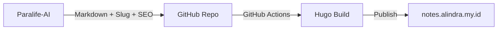

# 📔 Ardnotes - Alindra's Digital Garden

**Ardnotes** adalah kebun digital tempat saya mendokumentasikan perjalanan sebagai **Presales Engineer dan Tech Enthusiast** — campuran catatan teknis, refleksi belajar, dan hal-hal kecil yang layak diarsipkan. Seluruh siklus hidup catatan, dari penulisan sampai tayang di web, dikelola penuh oleh [Paralife-AI](https://github.com/alsetyaardana/paralife-ai.git), lalu dirender statis lewat Hugo.

---

## 🏗️ Cara Kerja

```mermaid
graph LR
    A[Paralife-AI] -- "Markdown + Slug + SEO" --> B[GitHub Repo]
    B -- "GitHub Actions" --> C[Hugo Build]
    C -- "Publish" --> D[notes.alindra.my.id]
```

Paralife-AI bertindak sebagai otak di balik layar: menyiapkan konten, slug, frontmatter, dan optimasi SEO sebelum masuk ke repo ini. Dari titik itu, GitHub Actions mengambil alih — build dengan Hugo lalu deploy ke `notes.alindra.my.id` setiap kali ada push.

## 🛠️ Tech Stack
- **Engine**: Hugo dengan tema PaperMod.
- **Automation**: [Paralife-AI](https://github.com/alsetyaardana/paralife-ai.git) — mengelola seluruh alur publikasi catatan.
- **CI/CD**: GitHub Actions untuk build & deploy otomatis.

## 📂 Struktur Project
- `.github/workflows/` — skrip GitHub Actions (gh-pages.yml).
- `content/posts/` — artikel .md hasil publikasi Paralife-AI.
- `themes/PaperMod/` — submodule tema blog.
- `hugo.yaml` — konfigurasi utama site.
- `static/` — aset gambar dan file statis lainnya.

## 👤 Maintainer
Alindra Setya Ardana — Presales Engineer / Solution Architect Enthusiast. Fokus di IT Networking, Security, dan Agentic AI.
